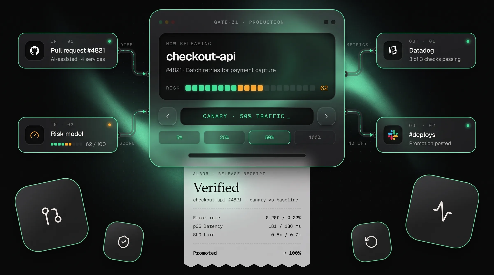
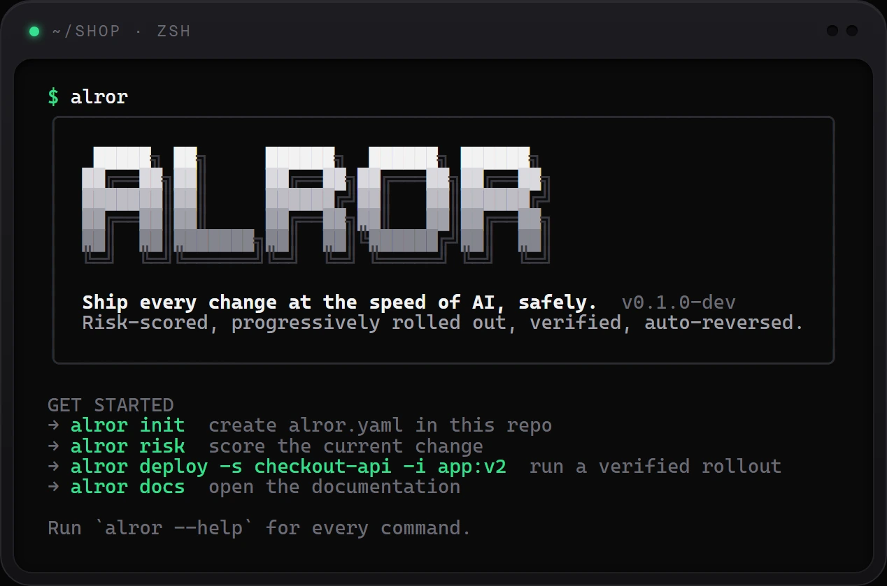
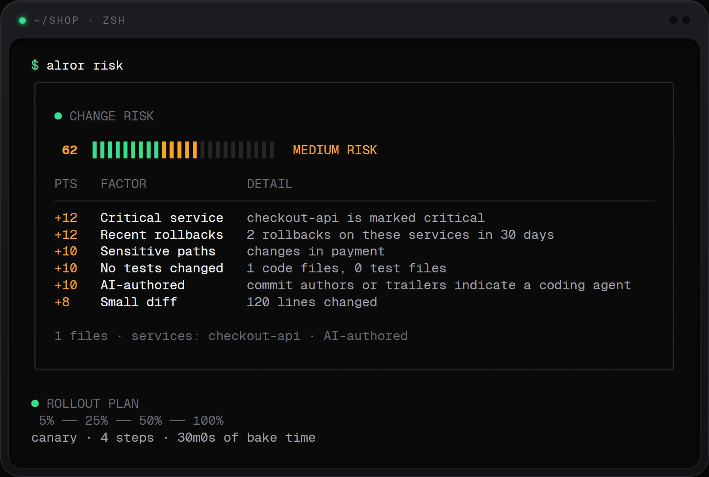
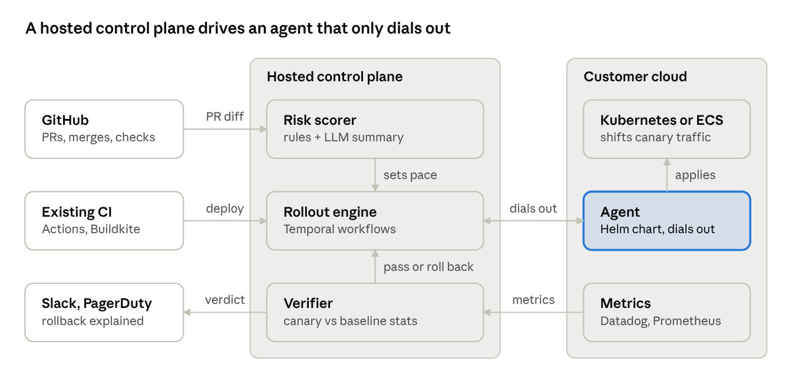

<div align="center">


# alror

**Ship every change at the speed of AI, safely.**

Alror scores every change for risk, rolls it out in steps, verifies each step against live metrics,<br/>
and rolls back on its own when a release hurts users. Keep your CI. Be live in under an hour.

[Install](#install) · [Quickstart](#quickstart) · [How it works](#how-it-works) · [GitHub](#github-integration) · [SDKs](#sdks) · [Architecture](ARCHITECTURE.md) · [Contributing](CONTRIBUTING.md)

[](https://github.com/manaskumar3003/alror-cli/actions/workflows/ci.yml)


<br/>



</div>

---

## Why Alror

AI made writing code cheap. Releasing it safely is still slow, manual and risky. Teams merge more changes than ever, many written by agents, yet most pipelines still treat a green test run as proof that a change is safe.

Alror is the release gate between merge and production:

| | |
| --- | --- |
| **Risk-scored** | Every change gets a 0–100 score from named, auditable factors: blast radius, sensitive paths, tests, AI authorship and recent rollbacks. |
| **Progressive** | The score picks the plan. Risky changes get smaller canaries, more steps and longer bakes. |
| **Verified** | At each step, the canary is compared with the baseline using a Mann-Whitney U test **and** an effect-size threshold, so false rollbacks are rare. |
| **Reversible** | A regression rolls traffic back in seconds, with a plain-English reason, and the run exits with code `2` so CI can tell. |
| **Boring state** | Every deployment and event is a plain JSON file under `.alror/`. Nothing phones home. |

## Install

**macOS / Linux**
```bash
curl -fsSL https://raw.githubusercontent.com/manaskumar3003/alror-cli/main/scripts/install.sh | sh
```

**Windows (PowerShell)**
```powershell
irm https://raw.githubusercontent.com/manaskumar3003/alror-cli/main/scripts/install.ps1 | iex
```

**With Go 1.22+**
```bash
go install github.com/manaskumar3003/alror-cli/cmd/alror@latest
```

**npm** (`npx alror`, `npm i -g alror`) ships the same binary for JavaScript projects. The packages are built on every release but not yet published to npm; until then install the tarball attached to a [GitHub release](https://github.com/manaskumar3003/alror-cli/releases), e.g. `npm i -g <release-url>/alror-<version>.tgz`.

The install scripts verify the release checksum. Prefer to build from source? `go build -o bin/ ./cmd/...`.

## Quickstart

```bash
cd path/to/your/repo
alror init                          # alror.yaml + .alror/
alror risk                          # score your current change
alror deploy -s checkout-api -i registry/checkout:1.42 --ref "#4821"
alror deploy -s checkout-api -i registry/checkout:1.43 --regress error_rate=1.8   # watch a rollback
alror status                        # history
alror docs --open                   # full docs at http://127.0.0.1:4100
```

No infrastructure is needed to try it: the default target and metrics are simulated.

**Guided tour (Windows PowerShell):** `.\scripts\demo.ps1` builds the CLI, creates a sandbox repo with an AI-authored change and walks through every command live, step by step. Press Enter to run each one.



## How it works

### 1. Score the change

`alror risk` reads the diff against `main` and explains every point:



| Level | Score | Plan |
| --- | --- | --- |
| Low | 0–34 | 25% → 100%, 5 min bake |
| Medium | 35–69 | 5% → 25% → 50% → 100%, 10 min bakes |
| High | 70–100 | 1% → 5% → 25% → 50% → 100%, 15 min bakes |

### 2. Roll out and verify

`alror deploy` shifts traffic step by step, bakes, compares the canary with the baseline, and prints a release receipt:

<table>
<tr>
<td width="50%"></td>
<td width="50%"></td>
</tr>
<tr>
<td align="center"><sub><b>Healthy:</b> verified at every step, promoted to 100%</sub></td>
<td align="center"><sub><b>Regression:</b> error rate +70% at 5% traffic, rolled back automatically</sub></td>
</tr>
</table>

```
pending ──▶ rolling ─┬─ every step passes ───────────────▶ promoted
                     ├─ a step fails, auto_rollback ───────▶ rolled_back   (exit 2)
                     ├─ a step fails, shadow mode ─────────▶ continue, recommendation logged
                     └─ driver or provider error ──────────▶ failed        (rollback attempted)
```

### 3. Architecture



The engine runs inside the CLI, usually as one CI step. It keeps state on the file system (local mode) or in your Alror workspace (connected mode); console-triggered releases run on `alror runner` in your own infrastructure. See **[ARCHITECTURE.md](ARCHITECTURE.md)** for details.

## GitHub integration

Every pull request gets an **Alror / change-risk** check with the score, the factors and the rollout plan, plus one sticky comment that is updated on each push. Deploys from Actions write the release receipt to the job summary.

```yaml
# .github/workflows/alror.yml   (full example: examples/github-workflow.yml)
jobs:
  risk:
    runs-on: ubuntu-latest
    permissions: { contents: read, checks: write, pull-requests: write }
    steps:
      - uses: actions/checkout@v4
        with: { fetch-depth: 0 }
      - uses: manaskumar3003/alror-cli/actions/check@main
        with: { comment: "true", fail-above: "0" }
```

<details>
<summary><b>What the PR comment looks like</b></summary>

> ### 🟠 Alror change risk: **68/100 · medium**
> `█████████████░░░░░░░` 68/100
>
> | Points | Factor | Detail |
> | ---: | --- | --- |
> | +18 | Recent rollbacks | 3 rollbacks on these services in 30 days |
> | +12 | Critical service | checkout-api is marked critical |
> | +10 | Sensitive paths | changes in payment |
> | +10 | AI-authored | commit authors or trailers indicate a coding agent |
>
> **Rollout plan:** canary 5% → 25% → 50% → 100%, 10m0s bake per step

</details>

| Command | What it does |
| --- | --- |
| `alror github check --comment` | Post the check run and the sticky comment (inside Actions) |
| `alror github check --fail-above 85` | Turn the check into a merge gate (exit `3`) |
| `alror github check --dry-run` | Print the Markdown locally |

## Web console

The Alror web console (the self-hosted Alror platform) is your Alror workspace: the CLI connects to it in [connected mode](#connected-mode), and it shows live rollouts, services, a rollout tree for each release, insights and policies. Deploys and rollbacks started from the console run on `alror runner`.

<table>
<tr>
<td width="50%"></td>
<td width="50%"></td>
</tr>
</table>

## Connected mode

Alror runs in local mode by default (`alror.yaml` + `.alror/`). Connect the CLI to your Alror workspace (the self-hosted Alror web platform) with an API key, and the same commands read services and policy from the workspace and write deployments and events through its API. The console then shows every release live and can queue deploys and rollbacks for `alror runner`.

```bash
alror login --server http://localhost:3000 --key alr_live_…   # verifies with /whoami, saves to the user config dir (0600)
alror whoami                                                    # workspace, actor, scopes
alror deploy -s checkout-api -i app:v2                          # state: acme workspace (http://localhost:3000)
alror runner                                                    # run deploys and rollbacks queued from the console
alror config pull                                               # write alror.yaml from the workspace (keeps server:)
alror config push                                               # upsert services and policy (admin keys)
```

- **Server and key:** `--server`/`--api-key` flags, then `ALROR_SERVER`/`ALROR_API_KEY`, then `server:` in `alror.yaml`, then the saved login. In CI, set the two env vars.
- **`alror.yaml` is optional** when connected; if present, its `services[].paths` still map git paths to services. The workspace wins on everything else.
- **`--local`** forces local mode for one command. With no server configured, nothing changes.
- **`alror runner`** runs deploys and rollbacks queued from the console inside your own infrastructure, like a CI runner. It claims jobs with a long-poll, runs them with the engine, and reports `done` or `failed`. A rolled-back release is `done` (an outcome, not a failure). Ctrl-C finishes the current job, and the runner backs off while the workspace is down.

Full guide: `alror docs` → *Connected mode*. The API contract is in [docs/platform-contract.md](docs/platform-contract.md).

## SDKs

Build on the same API from your own tools.

**Go**: `pkg/alror`
```go
import "github.com/manaskumar3003/alror-cli/pkg/alror"

client := alror.NewClient("https://alror.example.com", os.Getenv("ALROR_API_KEY"))
job, err := client.EnqueueDeploy(ctx, alror.DeployRequest{Service: "checkout-api", Image: "registry/checkout:1.42"})
```
`pkg/alror/risk` exposes the rule-based risk scorer for library use.

**TypeScript / JavaScript**: [`@alror/sdk`](sdk/js) (Node 18+, ESM + CJS, no dependencies)
```ts
import { Alror } from "@alror/sdk";

const alror = new Alror({ server: "https://alror.example.com", apiKey: process.env.ALROR_API_KEY! });
await alror.enqueueDeploy({ service: "checkout-api", image: "registry/checkout:1.42" });
for await (const d of alror.iterDeployments({ status: "rolled_back" })) console.log(d.id, d.reason);
```
Not on npm yet; build it from `sdk/js` or use the tarball attached to each release.

## Commands

| Command | Description |
| --- | --- |
| `alror init` | Create `alror.yaml` and the `.alror/` state directory |
| `alror risk` | Score the diff and show the rollout plan |
| `alror deploy -s <svc> -i <image>` | Run a risk-scored, verified progressive rollout |
| `alror status [id]` | List deployments, or show one with its event log |
| `alror rollback <id>` | Roll a deployment back |
| `alror github check` | Post a PR risk check and sticky comment |
| `alror doctor` | Check config, tools and connections (and the workspace connection, when connected) |
| `alror login` / `logout` / `whoami` | Connect to an Alror workspace, disconnect, or show the connection |
| `alror runner` | Run deploys and rollbacks queued from the console, in your own infrastructure |
| `alror config pull` / `push` | Sync `alror.yaml` with the workspace |
| `alror docs` | Serve the documentation (embedded, offline) |

Global flags: `-C <dir>`, `--json`, `--color auto|always|never`, `--no-anim`, `--server`, `--api-key`, `--local`.<br/>
Exit codes: `0` promoted · `1` error · `2` rolled back · `3` risk gate.

## Configuration

```yaml
project: shop
services:
  - name: checkout-api
    paths: [services/checkout/]
    target: kubernetes      # simulated | kubernetes | ecs (phase 2)
    critical: true
metrics:
  provider: prometheus      # synthetic | prometheus | datadog
  url: http://prometheus:9090
policy:
  max_regression: { error_rate: 0.25, latency_p95: 0.15 }
  alpha: 0.05
  auto_rollback: true       # false = shadow mode
notify:
  slack_webhook: https://hooks.slack.com/services/…
```

## Project layout

```
cmd/alror, cmd/alror-docs     binaries
cmd/alror-devserver           in-memory fake workspace API for demos
pkg/alror (+ risk)            public Go SDK: API client, types, risk scorer
internal/api (+ apitest)      workspace API client and in-memory fake
internal/credentials          saved login and server/key precedence
internal/runner               job loop for `alror runner`
internal/risk                 git diff → rule-based risk score
internal/rollout              planner + engine state machine
internal/verify               Mann-Whitney U verdicts
internal/metrics              synthetic, Prometheus, Datadog
internal/driver               simulated, Kubernetes (Argo Rollouts), ECS stub
internal/store                Store: file system (.alror/) and Remote (API)
internal/github               checks, sticky comments, job summaries
internal/cli (+ ui)           commands and the terminal design system
internal/docsite              embedded docs server
actions/check, actions/deploy GitHub composite actions
examples/                     alror.yaml and a GitHub workflow to copy
sdk/js                        @alror/sdk, the TypeScript SDK
npm/                          npm distribution of the CLI binary (npx alror)
scripts/                      install.sh, install.ps1, demo.ps1 (guided tour)
```

## Development

```bash
go test ./...                      # Go: engine, store, api, runner, cli, pkg/alror
cd sdk/js && npm ci && npm test    # TypeScript SDK
cd npm && npm test                 # npm launcher and release tooling
```

Releases: push a `v*` tag. GoReleaser builds binaries for Linux, macOS and Windows (amd64 + arm64) with checksums, and the npm tarballs are attached to the release.

## Contributing, security, license

Contributions are welcome: see [CONTRIBUTING.md](CONTRIBUTING.md). Report vulnerabilities privately as described in [SECURITY.md](SECURITY.md). Licensed under [Apache-2.0](LICENSE).

---

<div align="center"><sub>Rules decide, AI explains. Every rollback comes from a statistical test, never a model's opinion.</sub></div>
